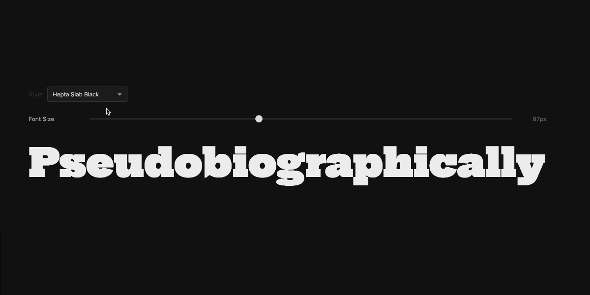

# font-tester

Interactive web component for testing and previewing fonts. No dependencies. Built for [Fountain](https://fountain.nymarktype.co) but works anywhere.

## Features

- Live text preview with editable text
- Font style/weight variant selector
- Adjustable size, line height, and letter spacing
- Variable font axis sliders
- OpenType feature toggles
- Custom sample texts
- Lazy font loading via [font-loader](https://github.com/andreasnymark/font-loader) (optional)
- Themeable via CSS custom properties and `::part()`
- i18n support

## Usage

```html
<font-tester font-family="my-font" controls="text-controls,font-size,line-height,letter-spacing,font-style,opentype">

  <!-- Font style variants -->
  <font-style name="Regular" family="my-font" weight="400" style="normal" default></font-style>
  <font-style name="Italic" family="my-font" weight="400" style="italic"></font-style>
  <font-style name="Bold" family="my-font" weight="700" style="normal"></font-style>

  <!-- OpenType features -->
  <opentype-feature code="kern" name="Kerning" default></opentype-feature>
  <opentype-feature code="liga" name="Ligatures" default></opentype-feature>
  <opentype-feature code="smcp" name="Small Caps"></opentype-feature>

  <!-- Sample texts (first is shown by default; named ones appear in the dropdown) -->
  <sample-text>The quick brown fox jumps over the lazy dog</sample-text>
  <sample-text name="Alphabet">ABCDEFGHIJKLMNOPQRSTUVWXYZabcdefghijklmnopqrstuvwxyz</sample-text>
  <sample-text name="Numbers">0123456789</sample-text>

</font-tester>
```

### Variable fonts

For variable fonts, use `var-axes` in `controls` and declare axes via `<font-variation-axis>` markers instead of `<font-style>` variants. The two are mutually exclusive.

```html
<font-tester font-family="my-variable-font" controls="text-controls,font-size,line-height,var-axes">

  <font-variation-axis tag="wght" name="Weight" min="100" max="900" default="400"></font-variation-axis>
  <font-variation-axis tag="wdth" name="Width" min="75" max="125" default="100"></font-variation-axis>
  <font-variation-axis tag="OPSZ" name="Optical size" min="6" max="72" default="14" step="0.1"></font-variation-axis>

</font-tester>
```

Each axis renders as a range slider. All axes compose into a single `font-variation-settings` value applied to the preview text.

Axis attributes: `tag` (4-char axis tag, required), `name` (label), `min`, `max`, `default`, `step`.

Layout is controlled via CSS custom properties on `var-axes-controls`:

```css
font-tester var-axes-controls {
  --axis-flex-basis: 200px; /* min width per axis — controls how many fit per row */
  --axis-gap: 20px;
}
```

### Fit width

Add the `fit-width` attribute to automatically scale the font size so the preview text fills the full width of the display area. Useful for single-word or headline display testing.

```html
<font-tester font-family="my-font" fit-width="each">
  <sample-text>Stockholm</sample-text>
</font-tester>
```

The font size is calculated using the browser's layout engine, so letter-spacing, variable axes, and OpenType features are all accounted for. A 2px safety margin is applied to prevent overflow.

Two modes are available via the attribute value:

| Value | Behaviour |
|---|---|
| `each` (or bare `fit-width`) | Recalculates on every font load, including style/weight changes |
| `once` | Fits once on the first font load, then leaves the size alone |

`once` is useful when you want the initial size set automatically but still want full control of the font-size slider afterwards.

If a `font-size` slider is included in `controls`, it stays in sync — it updates to show the calculated value and can still be used to manually override it. With `each`, the fit is restored on the next font change.

`fit-width` works with or without `text-controls`. If `text-controls` is omitted, the first `<sample-text>` is shown directly without a dropdown.

### Initial style defaults

Set starting values for the typography controls directly on `<font-tester>`:

```html
<font-tester
  font-family="my-font"
  font-size="64px"
  line-height="1.2"
  letter-spacing="0.02em"
  text-align="center"
  direction="rtl"
>
```

These are read once at connect time — sliders initialise at these values and the display renders with them applied. They are not reactive after mount.

### `controls` attribute

Comma-separated list of controls to show. Omit the attribute entirely to show all controls.

| Value | Control |
|---|---|
| `text-controls` | Uppercase toggle, text direction, text alignment |
| `font-size` | Font size slider |
| `line-height` | Line height slider |
| `letter-spacing` | Letter spacing slider |
| `font-style` | Style/weight variant dropdown (static fonts) |
| `opentype` | OpenType features dialog |
| `var-axes` | Variable font axis sliders |

### Including the script

```html
<script type="module" src="font-tester.min.js"></script>
```

## Font loading

### With `@font-face` (simplest)

Register fonts in CSS as usual. Pass the family name via the `font-family` attribute:

```html
<style>
  @font-face {
    font-family: 'my-font';
    src: url('/fonts/my-font.woff2') format('woff2');
  }
</style>

<font-tester font-family="my-font">...</font-tester>
```

### With font-loader (lazy loading)

[font-loader](https://github.com/andreasnymark/font-loader) loads fonts on demand via the FontFace API as testers enter the viewport — no `@font-face` CSS needed.

```html
<script type="importmap">
{
  "imports": {
    "font-loader": "/js/font-loader.min.js"
  }
}
</script>
<script type="module" src="/js/font-loader.min.js"></script>
<script type="module" src="/js/font-tester-with-loader.min.js"></script>
```

The `font-tester-with-loader.min.js` bundle includes `font-tester-loader.js`, which bridges the two libraries. Use `font-tester.min.js` (without the loader) if you're using `@font-face`.

## Theming

All visual styling is exposed via CSS custom properties and `::part()` selectors. Copy `font-tester-theme.css` as a starting point:

```css
font-tester {
  --container-max-width: 1200px;
  --divider-color: #e0e0e0;
  /* ... */
}

font-tester font-display {
  --display-bg: #f9f9f9;
  --text-color: #111;
  /* ... */
}

font-tester text-controls::part(button) {
  border-radius: 0;
}
```

See `font-tester-theme.css` for the full reference.

## Internationalization

UI labels can be translated via an inline or external JSON file. See [FONT-TESTER-I18N-README.md](./FONT-TESTER-I18N-README.md) for setup and the full list of translation keys.

```html
<script id="font-tester-i18n" type="application/json">
{
  "sv": {
    "textControls": { "uppercaseButton": "Versaler" }
  }
}
</script>

<font-tester lang="sv">...</font-tester>
```

## Why a web component?

Two reasons. One is to make it feel native to HTML. The other is that each instance gets its own shadow root, so the browser recalculates styles in isolation — with 20+ instances on a page that makes a meaningful difference.

## License

MIT
